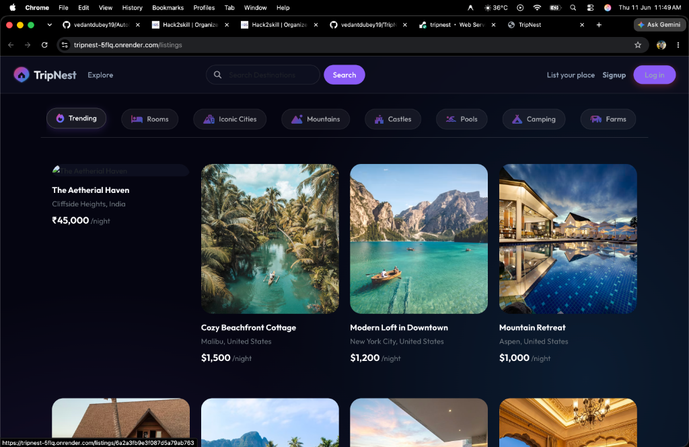
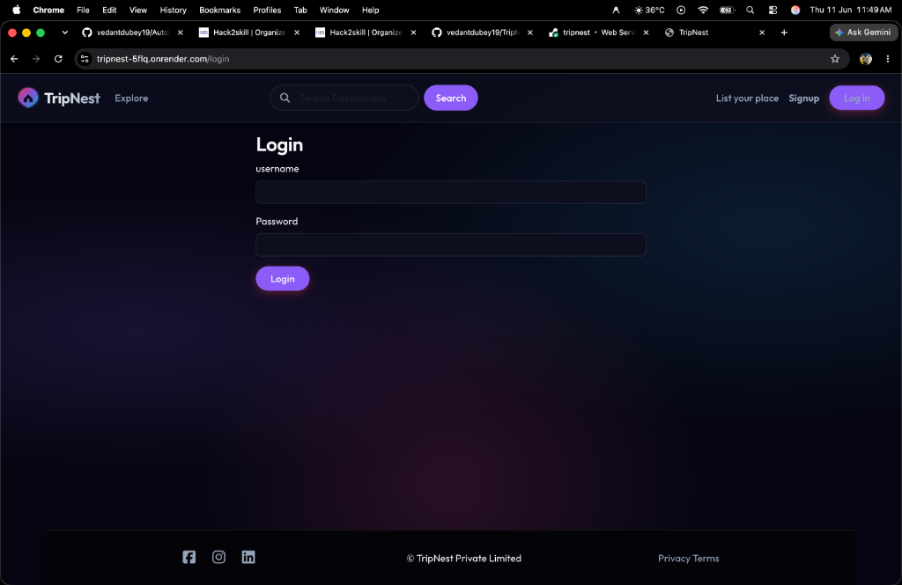

# 🌍 TripNest – Full-Stack Travel Destination listing Web App

TripNest is a premium, full-stack travel listing and reservation application designed to simplify how people explore, list, and book beautiful destinations. Outfitted with sleek aesthetics, responsive card grids, dynamic Mapbox integration, and secure authentication, TripNest is a complete portal for the modern traveler.

---

## 📷 Screenshots

### Explore Destinations (Home Page)


### Secure Authentication (Login Page)


---

## ✨ Features

- 🌎 **Explore Destinations:** Responsive card layouts showcasing various stays with dynamic pricing formatted by country.
- 🗺️ **Interactive Maps:** Real-time Mapbox GL JS integration showing the exact location coordinates of listings.
- 📅 **Reservations:** Integrated date pickers (Flatpickr) allowing users to reserve listings dynamically.
- ✍️ **Reviews & Ratings:** Interactive ratings utilizing `starability` styles, where users can submit and manage their reviews.
- 🔐 **Secure Authentication:** User signup, login, session persistence, and authorization guards (via Passport.js).
- 🖼️ **Image Cloud Storage:** Multiphase image uploading powered by Cloudinary and Multer.
- 🎨 **Premium UI/UX:** Harmony color palettes, modern Outfit typography, glassmorphism visual elements, and hover animations.

---

## 🛠️ Tech Stack

**Frontend**
- EJS (Embedded JavaScript Templates) with EJS-Mate layout engines
- Bootstrap 5 + Vanilla Custom CSS
- Mapbox GL JS (Mapping & Geocoding)
- Flatpickr (Interactive Date Pickers)

**Backend**
- Node.js & Express.js
- Passport.js (Local authentication strategy)
- Joi (Object schema validation)
- Multer & Multer-Storage-Cloudinary (File upload handling)

**Database & Storage**
- MongoDB (Mongoose ODM)
- Connect-Mongo (Session storage persistence)
- Cloudinary (Image hosting storage)

---

## 📂 Project Structure

```text
TripNest/
├── assets/            # App screenshots & promotional assets
├── client/
│   ├── public/        # Static files (CSS, JS, Images)
│   └── views/         # EJS Templates (layouts, includes, listings, users)
├── server/
│   ├── controllers/   # Business logic / controllers
│   ├── init/          # Database seeding scripts & sample data
│   ├── models/        # Mongoose Schema Definitions
│   ├── routes/        # Express Routing
│   ├── utils/         # Error handling and helper utilities
│   ├── app.js         # Entrypoint configuration
│   └── middleware.js  # Authorization and validation middlewares
```

---

## ⚙️ Local Installation & Setup

### 1️⃣ Clone the Repository
```bash
git clone https://github.com/vedantdubey19/TripNest.git
cd TripNest
```

### 2️⃣ Install Dependencies
```bash
npm install
```

### 3️⃣ Configure Environment Variables
Create a `.env` file in the root directory and add the following keys (see `.env.example` as a template):
```env
# Mapbox Credentials
MAP_TOKEN=your_mapbox_public_access_token_here

# Cloudinary Credentials (for image uploads)
CLOUD_NAME=your_cloudinary_cloud_name
CLOUD_API_KEY=your_cloudinary_api_key
CLOUD_API_SECRET=your_cloudinary_api_secret

# Session Secret
SECRET=your_session_secret_here

# Database URL (Defaults to local if not specified)
DB_URL=mongodb://127.0.0.1:27017/tripnest
```

### 4️⃣ Seed the Database
Initialize your local database with sample travel listings:
```bash
node server/init/index.js
```

### 5️⃣ Run the Application
Start the development server:
```bash
npm run dev
```
Open [http://localhost:8080](http://localhost:8080) to explore the website locally.

---

## 🚀 Deployment (Render + MongoDB Atlas)

1. **Database:** Deploy a free cluster on [MongoDB Atlas](https://www.mongodb.com/) and whitelist all IPs. Copy the connection string.
2. **Repository:** Push your project to GitHub.
3. **Web Service:** Create a new Web Service on [Render](https://render.com/), connecting your repo.
4. **Build & Start commands:** Set the build command to `npm install` and the start command to `npm start`.
5. **Environment Variables:** Inject `DB_URL` (your Atlas URI), `MAP_TOKEN`, and `SECRET` into your Render service environment settings.
